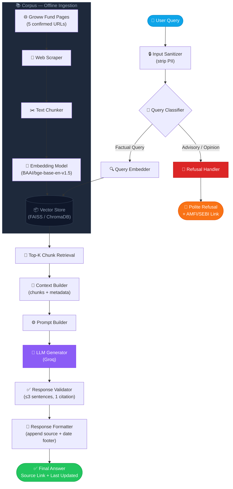
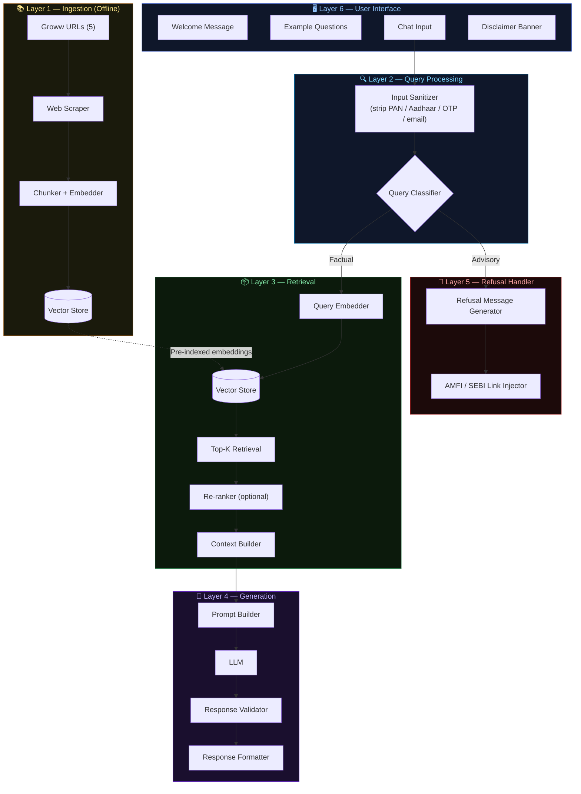
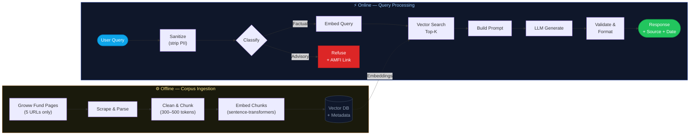

# Architecture: Mutual Fund FAQ Assistant (RAG-Based)

> A facts-only, retrieval-augmented question-answering system for mutual fund schemes listed on Groww.

---

## 1. System Overview

The Mutual Fund FAQ Assistant is built on a **Retrieval-Augmented Generation (RAG)** architecture. Rather than relying on a language model's parametric memory, the system retrieves relevant factual content from a curated, pre-indexed corpus of official mutual fund documents, and uses the LLM only to format and surface that retrieved content as a concise, citation-backed answer.



---

## 2. Architecture Layers

### Layer 1 — Data Ingestion & Corpus Building

**Purpose:** Scrape, chunk, embed, and index the 5 official Groww mutual fund pages as the sole corpus source.

| Step | Action | Tools / Notes |
|------|--------|---------------|
| 1.1 | Fetch content from the 5 Groww fund pages | Web scraper / HTTP client (requests + BeautifulSoup) |
| 1.2 | Clean & chunk scraped text into retrievable segments | Chunk size: ~300–500 tokens, 50-token overlap |
| 1.3 | Attach metadata to each chunk: source URL, fund name, scrape date | Per-chunk metadata dict |
| 1.4 | Embed chunks using a sentence embedding model | `BAAI/bge-base-en-v1.5` (sentence-transformers / FlagEmbedding) |
| 1.5 | Store embeddings in a vector database | FAISS (local) / ChromaDB |

**Source URLs (sole external corpus — 5 Groww pages):**

| # | Fund | URL |
|---|------|-----|
| 1 | ICICI Prudential Large Cap Fund | https://groww.in/mutual-funds/icici-prudential-large-cap-fund-direct-growth |
| 2 | Kotak Emerging Equity Scheme | https://groww.in/mutual-funds/kotak-emerging-equity-scheme-direct-growth |
| 3 | HDFC Small Cap Fund | https://groww.in/mutual-funds/hdfc-small-cap-fund-direct-growth |
| 4 | HSBC Midcap Fund | https://groww.in/mutual-funds/hsbc-midcap-fund-direct-growth |
| 5 | Bajaj Finserv Flexi Cap Fund | https://groww.in/mutual-funds/bajaj-finserv-flexi-cap-fund-direct-growth |

---

### Layer 2 — Query Processing

**Purpose:** Classify incoming user queries and route them appropriately.

```
User Input
    │
    ▼
[Input Sanitizer]          — Strip PII (PAN, Aadhaar, account numbers, OTPs, email, phone)
    │
    ▼
[Query Classifier]         — Rule-based or LLM-based intent classification
    │
    ├── FACTUAL             → proceed to retrieval pipeline
    └── ADVISORY / OPINION  → route to Refusal Handler
```

**Factual Query Examples:**
- "What is the expense ratio of HDFC Small Cap Fund?"
- "What is the exit load for Kotak Emerging Equity?"
- "What is the minimum SIP for ICICI Prudential Large Cap?"
- "What is the lock-in period for ELSS funds?"
- "How do I download my capital gains statement?"

**Refused Query Examples:**
- "Should I invest in HDFC Small Cap Fund?"
- "Which fund is better — ICICI or Kotak?"
- "What returns will I get in 5 years?"

---

### Layer 3 — Retrieval Pipeline

**Purpose:** Find the most relevant chunks from the corpus for a given factual query.

```
Factual Query
    │
    ▼
[Query Embedder]           — Embed query using same model as corpus
    │
    ▼
[Vector Similarity Search] — Top-K retrieval (K = 3–5 chunks) from Vector Store
    │
    ▼
[Re-ranker] (optional)     — Cross-encoder re-ranking for precision (e.g., ms-marco-MiniLM)
    │
    ▼
[Context Builder]          — Assemble retrieved chunks + metadata (source URL, date)
```

**Retrieval Strategy:**

| Parameter | Value |
|-----------|-------|
| Embedding model | `BAAI/bge-base-en-v1.5` (BGE) |
| Similarity metric | Cosine similarity |
| Top-K chunks | 3–5 |
| Chunk size | 300–500 tokens |
| Chunk overlap | 50 tokens |
| Metadata stored | source URL, document type, fund name, last updated date |

---

### Layer 4 — Response Generation

**Purpose:** Use an LLM to produce a concise, factual answer grounded in retrieved context.

```
[Context + Query]
    │
    ▼
[Prompt Builder]           — Injects system prompt + retrieved context + user query
    │
    ▼
[LLM (Generator)]          — Generates response strictly from context
    │
    ▼
[Response Validator]       — Checks: ≤ 3 sentences | 1 citation | no advice language
    │
    ▼
[Response Formatter]       — Appends footer: "Last updated from sources: <date>"
    │
    ▼
Final Response to User
```

**System Prompt (core constraints):**

```
You are a facts-only mutual fund FAQ assistant.
- Answer ONLY using the provided context.
- Your response must be 3 sentences or fewer.
- You must include exactly one source citation link.
- Do NOT provide investment advice, opinions, or return predictions.
- If the context does not contain the answer, say: "I don't have verified information on that. Please refer to [official source]."
```

---

### Layer 5 — Refusal Handler

**Purpose:** Handle non-factual, advisory, or out-of-scope queries gracefully.

**Trigger conditions:**
- Query contains advisory intent ("should I", "which is better", "recommend", "best fund")
- Query requests return predictions or performance comparisons
- Query falls outside the scope of the 5 selected fund schemes

**Refusal Response Template:**

```
"I'm set up to answer facts-only questions about mutual fund schemes — such as 
expense ratios, exit loads, and SIP details. I'm not able to provide investment 
advice or recommendations. For guidance, please visit [AMFI Investor Education](https://www.amfiindia.com/investor-corner/investor-education.html)."
```

---

### Layer 6 — User Interface

**Purpose:** Minimal, clean UI for end users to interact with the assistant.

| Element | Description |
|---------|-------------|
| Welcome message | Brief intro stating the facts-only scope |
| Example questions | 3 pre-filled clickable prompts |
| Chat input | Single text field for user queries |
| Response area | Shows answer + source citation + date footer |
| Disclaimer (persistent) | *"Facts-only. No investment advice."* |
| Refusal display | Clearly styled, polite refusal with AMFI/SEBI link |

---

## 3. Component Diagram



---

## 4. Data Flow



---

## 5. Technology Stack

| Component | Recommended Tool | Alternatives |
|-----------|-----------------|--------------|
| Web scraping | BeautifulSoup + requests | Playwright, Scrapy |
| PDF parsing | PyMuPDF / pdfplumber | PDFMiner |
| Text chunking | LangChain TextSplitter | LlamaIndex node parser |
| Embedding model | `BAAI/bge-base-en-v1.5` (FlagEmbedding / sentence-transformers) | `bge-small-en-v1.5`, `bge-large-en-v1.5` |
| Vector database | FAISS (local) | ChromaDB, Pinecone |
| LLM | Groq (`llama3-70b-8192` / `mixtral-8x7b`) | Gemini Flash, Mistral |
| RAG framework | LangChain | LlamaIndex |
| Backend API | FastAPI | Flask |
| Frontend UI | React / Vanilla HTML+JS | Streamlit (for prototyping) |

---

## 6. Constraints Enforced in Architecture

| Constraint | How It Is Enforced |
|------------|--------------------|
| No investment advice | System prompt hard-bans advisory language; classifier routes advisory queries to refusal handler |
| No PII collection | Input sanitizer strips PAN, Aadhaar, OTPs, phone, email before any processing |
| Facts only from official sources | Vector DB seeded exclusively from AMC, AMFI, SEBI, and Groww fund pages |
| Max 3 sentences | Response validator enforces sentence-count limit before returning |
| Exactly 1 citation | Response formatter injects source URL from chunk metadata |
| Last updated footer | Chunk metadata stores ingestion/source date; formatter appends it to every response |
| No third-party sources | Ingestion pipeline whitelists only approved domains |

---

## 7. Known Limitations

- **Data freshness:** Corpus must be re-ingested periodically as factsheets and fund details are updated by AMCs.
- **Coverage gaps:** Only 5 fund schemes are in scope; queries about other funds will be declined.
- **PDF parsing quality:** Complex table layouts in SID/KIM documents may not parse perfectly.
- **Hallucination risk:** Even with RAG, the LLM may deviate from retrieved context; the response validator mitigates but does not eliminate this.
- **No real-time NAV:** NAV data changes daily; the system does not provide live NAV values.
- **Language:** English only in the current scope.

---

## 8. Security & Privacy Design

- No user data is stored or logged beyond the current session.
- PII patterns (PAN regex, Aadhaar regex, phone/email) are detected and stripped at the input sanitization layer.
- All source documents are publicly available official sources — no proprietary or user-submitted data enters the corpus.
- No authentication or account management is in scope.

---

*Document version: 1.0 | Project: Mutual Fund FAQ Assistant | Reference: problemstatement.md*
