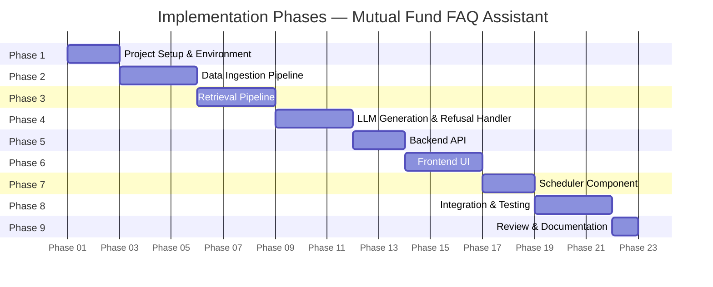

# Phase-Wise Implementation Plan
## Mutual Fund FAQ Assistant (RAG-Based)

> Based on: [architecture.md](./architecture.md) | [problemstatement.md](./problemstatement.md)

---

## Overview



---

## Phase 1 — Project Setup & Environment

**Goal:** Establish the project skeleton, dependencies, and folder structure.

### Tasks

| # | Task | Details |
|---|------|---------|
| 1.1 | Create project directory structure | `/ingestion`, `/retrieval`, `/generation`, `/api`, `/ui`, `/tests`, `/data` |
| 1.2 | Set up Python virtual environment | `python -m venv venv` |
| 1.3 | Install core dependencies | `requests`, `beautifulsoup4`, `FlagEmbedding`, `faiss-cpu`, `langchain`, `groq`, `fastapi`, `uvicorn` |
| 1.4 | Create `requirements.txt` | Pin all dependency versions |
| 1.5 | Set up `.env` file | Store Groq API key, BGE model name, config flags |
| 1.6 | Initialize `config.py` | Centralised constants: URLs, chunk size, top-K, model names |
| 1.7 | Set up `README.md` scaffold | Placeholder for setup instructions, known limitations |

### Deliverables
- `requirements.txt`
- `.env.example`
- `config.py`
- Project folder structure

---

## Phase 2 — Data Ingestion Pipeline *(Layer 1)*

**Goal:** Scrape the 5 Groww fund pages, chunk the content, embed it, and persist a vector store.

**Architecture reference:** Layer 1 — Data Ingestion & Corpus Building

### Tasks

| # | Task | Details |
|---|------|---------|
| 2.1 | Build `scraper.py` | Use `requests` + `BeautifulSoup` to fetch and parse each of the 5 Groww URLs |
| 2.2 | Extract structured content | Target: fund name, expense ratio, exit load, SIP details, riskometer, benchmark, lock-in |
| 2.3 | Clean raw HTML | Strip nav, footer, ads; keep main content sections only |
| 2.4 | Build `chunker.py` (v2) | Section-aware chunking: strip nav/holdings/footer noise, tag sections (`facts`, `faq`), split into 300-token chunks with 50-token overlap, and prepend fund name to each chunk for context |
| 2.5 | Attach metadata per chunk | `source_url`, `fund_name`, `amc`, `category`, `scraped_date`, `chunk_type` |
| 2.6 | Build `embedder.py` | Load `BAAI/bge-base-en-v1.5` via `FlagEmbedding`; embed all chunks |
| 2.7 | Build `vector_store.py` | Create and persist FAISS index with chunk embeddings + metadata |
| 2.8 | Build `ingest.py` (orchestrator) | End-to-end pipeline: scrape → chunk → embed → save index |
| 2.9 | Write ingestion tests | Verify chunk count, metadata presence, index shape |

### Chunking Strategy (v2)
- **Noise-Stripping**: The raw scraped text is pre-processed to remove the top navigation header (`Ctrl+K` marker), the massive holdings table (irrelevant for RAG), and the footer sitemaps.
- **Context Prefixing**: Every generated chunk is explicitly prefixed with `[Fund Name]` so the LLM and vector search never lose context.
- **Section Tagging**: Chunks are tagged with `chunk_type` metadata (`facts`, `faq`, `returns`, `about`, `general`) to allow for future filtering.
- **Sizing**: Chunks are sized to 300 tokens (via `tiktoken`) with a 50-token overlap to ensure high precision during vector search.

### Embedding Strategy
- **Model**: We are using **`BAAI/bge-small-en-v1.5`** (384 dimensions).
- **Why Small over Large?**: Our final RAG corpus is extremely small and highly dense (only 26 heavily-curated chunks across 5 funds). A large embedding model (like `bge-large` with 1024 dims) is designed for massive, complex corpora and would only introduce unnecessary memory overhead and latency here. The `bge-small` model is lightning-fast, uses minimal RAM, and is more than capable of capturing the semantic intent of our concise FAQ and factual chunks. 
- **Retrieval Asymmetry**: BGE models are asymmetrical, meaning we apply a specific instruction prefix ("Represent this sentence for searching relevant passages:") only to the user's query, while the document chunks are embedded without the prefix.

### Source URLs

| # | Fund | URL |
|---|------|-----|
| 1 | ICICI Prudential Large Cap Fund | https://groww.in/mutual-funds/icici-prudential-large-cap-fund-direct-growth |
| 2 | Kotak Emerging Equity Scheme | https://groww.in/mutual-funds/kotak-emerging-equity-scheme-direct-growth |
| 3 | HDFC Small Cap Fund | https://groww.in/mutual-funds/hdfc-small-cap-fund-direct-growth |
| 4 | HSBC Midcap Fund | https://groww.in/mutual-funds/hsbc-midcap-fund-direct-growth |
| 5 | Bajaj Finserv Flexi Cap Fund | https://groww.in/mutual-funds/bajaj-finserv-flexi-cap-fund-direct-growth |

### Deliverables
- `ingestion/scraper.py`
- `ingestion/chunker.py`
- `ingestion/embedder.py`
- `ingestion/vector_store.py`
- `ingestion/ingest.py`
- `data/faiss_index/` (persisted vector store)
- `tests/test_ingestion.py`

---

## Phase 3 — Retrieval Pipeline *(Layer 3)*

**Goal:** Implement query embedding and vector similarity search to retrieve the top-K relevant chunks, avoiding heavy ML dependencies.

**Architecture reference:** Layer 3 — Retrieval Pipeline

### Tasks

| # | Task | Details |
|---|------|---------|
| 3.1 | Build `retriever.py` | Load FAISS index; embed incoming query using same model (`BAAI/bge-small-en-v1.5`) |
| 3.2 | Implement top-K search | Inner Product (Cosine) similarity; retrieve K=3 chunks |
| 3.3 | Build `context_builder.py` | Assemble retrieved chunks into a single context string with source URL |
| 3.4 | Write retrieval tests | Assert correct fund facts are retrieved for known queries |

### Retrieval Strategy (v2)
- **Model**: Using `bge-small-en-v1.5` (384 dims).
- **Metric**: Inner Product (`IndexFlatIP`), equivalent to Cosine Similarity since chunks are L2-normalized.
- **Top-K**: Retrieving top 3 chunks (since the chunks are very dense, 3 chunks safely fit in the LLM context).
- **Thresholding**: We apply a hard similarity threshold to drop poor matches.
- **No Cross-Encoder**: Due to the extremely small corpus size (26 chunks), a secondary cross-encoder adds zero real value while severely bloating latency. We rely purely on dense retrieval.
- **Groq Rate-Limit Safeguards (Tokens)**: The `context_builder.py` will actively monitor and truncate the assembled context to strictly stay well under the `12K TPM` and `100K TPD` Groq limits. We will cap context tokens at `~1500` per query to allow for maximum concurrency (8 reqs/min) within the 12K TPM budget.

### Deliverables
- `retrieval/retriever.py`
- `retrieval/context_builder.py`
- `retrieval/reranker.py` *(optional)*
- `tests/test_retrieval.py`

---

## Phase 4 — LLM Generation & Refusal Handler *(Layers 4 & 5)*

**Goal:** Build the prompt assembly, LLM call, response validation, formatting, and the refusal handler.

**Architecture reference:** Layer 4 — Response Generation | Layer 5 — Refusal Handler

### Tasks

#### 4A — Query Classifier & Refusal Handler

| # | Task | Details |
|---|------|---------|
| 4.1 | Build `query_classifier.py` | Classify query as `FACTUAL` or `ADVISORY` using keyword rules + optional LLM call |
| 4.2 | Define advisory trigger patterns | Keywords: `"should I"`, `"which is better"`, `"recommend"`, `"best fund"`, `"returns"`, `"will it grow"` |
| 4.3 | Build `refusal_handler.py` | Return polite refusal message + AMFI Investor Education link |
| 4.4 | Build `input_sanitizer.py` | Strip PAN (regex), Aadhaar (regex), OTP patterns, email, phone before classification |

#### 4B — Response Generation

| # | Task | Details |
|---|------|---------|
| 4.5 | Build `prompt_builder.py` | Inject system prompt + retrieved context + user query into LLM input |
| 4.6 | System prompt — hardcode constraints | Max 3 sentences, 1 citation, no advice, fallback if context missing |
| 4.7 | Build `llm_client.py` | Wrapper around Groq API (`groq` SDK); model configurable via `.env` |
| 4.8 | Build `response_validator.py` | Assert: ≤3 sentences, contains 1 URL citation, no advisory phrases |
| 4.9 | Build `response_formatter.py` | Append footer: `"Last updated from sources: <scraped_date>"` |
| 4.10 | Write generation + refusal tests | Test known factual queries → correct format; test advisory queries → refusal response |

### System Prompt (locked)

```
You are a facts-only mutual fund FAQ assistant.
- Answer ONLY using the provided context.
- Your response must be 3 sentences or fewer.
- You must include exactly one source citation link.
- Do NOT provide investment advice, opinions, or return predictions.
- If the context does not contain the answer, say:
  "I don't have verified information on that. Please refer to [official source]."
```

### Deliverables
- `generation/query_classifier.py`
- `generation/input_sanitizer.py`
- `generation/refusal_handler.py`
- `generation/prompt_builder.py`
- `generation/llm_client.py`
- `generation/response_validator.py`
- `generation/response_formatter.py`
- `tests/test_generation.py`
- `tests/test_refusal.py`

---

## Phase 5 — Backend API *(FastAPI)*

**Goal:** Expose the full RAG pipeline as a REST API endpoint for the frontend to consume.

**Architecture reference:** Technology Stack — Backend API

### Tasks

| # | Task | Details |
|---|------|---------|
| 5.1 | Initialize FastAPI app in `api/main.py` | Single `POST /ask` endpoint |
| 5.2 | Define request/response models | `QueryRequest { query: str }` → `QueryResponse { answer: str, source: str, last_updated: str }` |
| 5.3 | Wire full pipeline in endpoint | Sanitize → Classify → [Retrieve + Generate] or [Refuse] → Return |
| 5.4 | Add CORS middleware | Allow frontend origin during development |
| 5.5 | Add `/health` endpoint | Returns `{ status: "ok" }` for basic uptime check |
| 5.6 | Write API integration tests | Test `/ask` with factual and advisory payloads |

### API Contract

```
POST /ask
Content-Type: application/json

Request:
{ "query": "What is the expense ratio of HDFC Small Cap Fund?" }

Response (factual):
{
  "answer": "The expense ratio of HDFC Small Cap Fund – Direct Growth is 0.67% as of the latest update.",
  "source": "https://groww.in/mutual-funds/hdfc-small-cap-fund-direct-growth",
  "last_updated": "2024-07-01"
}

Response (refusal):
{
  "answer": "I'm set up to answer facts-only questions...",
  "source": "https://www.amfiindia.com/investor-corner/investor-education.html",
  "last_updated": null
}
```

### Deliverables
- `api/main.py`
- `api/models.py`
- `api/pipeline.py` (pipeline orchestrator called by the endpoint)
- `tests/test_api.py`

---

## Phase 6 — Frontend UI *(Layer 6)*

**Goal:** Build a minimal, clean chat interface that surfaces the assistant to end users.

**Architecture reference:** Layer 6 — User Interface

### Tasks

| # | Task | Details |
|---|------|---------|
| 6.1 | Set up UI project | Vanilla HTML + CSS + JS (or React if preferred) in `/ui` folder |
| 6.2 | Build welcome screen | Title, one-line description, facts-only scope statement |
| 6.3 | Add 3 example question chips | Clickable pre-filled prompts that auto-submit the query |
| 6.4 | Build chat input + send button | Single text field; submit on Enter or button click |
| 6.5 | Build response display area | Show answer text + source link (clickable) + date footer |
| 6.6 | Style refusal responses distinctly | Different colour/icon for advisory refusals vs factual answers |
| 6.7 | Add persistent disclaimer banner | `"Facts-only. No investment advice."` — always visible |
| 6.8 | Connect UI to `/ask` API | `fetch` or `axios` call to FastAPI backend |
| 6.9 | Add loading state | Spinner while awaiting LLM response |

### UI Components

| Component | Requirement |
|-----------|-------------|
| Welcome message | Always visible at top |
| Example questions | 3 clickable chips (e.g., expense ratio, exit load, SIP) |
| Chat input | Single text field + send button |
| Answer card | Answer text + source URL + "Last updated" date |
| Refusal card | Styled differently with AMFI/SEBI link |
| Disclaimer | Persistent footer or banner |

### Deliverables
- `ui/index.html`
- `ui/style.css`
- `ui/app.js`

---

## Phase 7 — Scheduler Component *(Layer 2)*

**Goal:** Automate the ingestion pipeline to run daily and pull the latest data using GitHub Actions.

### Tasks

| # | Task | Details |
|---|------|---------|
| 7.1 | Create GitHub Actions Workflow | Build `.github/workflows/ingestion-scheduler.yml` to trigger `ingest.py` |
| 7.2 | Setup Cron Trigger | Configure the workflow to run on a daily schedule using `schedule: - cron:` |
| 7.3 | Configure Environment | Set up secrets (e.g., `GROQ_API_KEY`) and Python environment in the action |
| 7.4 | Commit Vector Store | Add a step to commit and push the updated FAISS index back to the repository |

### Deliverables
- `.github/workflows/ingestion-scheduler.yml`

---

## Phase 8 — Integration Testing & End-to-End Validation

**Goal:** Run the full pipeline end-to-end, verify all constraints, and fix any integration issues.

### Tasks

| # | Task | Details |
|---|------|---------|
| 8.1 | Run end-to-end with factual queries | Test all 5 funds across expense ratio, exit load, SIP, riskometer, benchmark |
| 8.2 | Test refusal handling | Verify advisory queries are refused with AMFI link |
| 8.3 | Test PII sanitization | Send queries containing fake PAN/Aadhaar — verify they are stripped |
| 8.4 | Validate response format | Assert ≤3 sentences, 1 citation, date footer present in all factual responses |
| 8.5 | Test out-of-scope queries | Queries about funds not in corpus → graceful refusal |
| 8.6 | Test UI on desktop and mobile | Responsive layout, disclaimer visible, examples clickable |
| 8.7 | Performance check | Response latency acceptable (<5s for typical query) |

### Test Query Matrix

| Query | Expected Outcome |
|-------|-----------------|
| "What is the expense ratio of HDFC Small Cap Fund?" | Factual answer + Groww source link |
| "What is the exit load for Kotak Emerging Equity?" | Factual answer + Groww source link |
| "What is the minimum SIP for ICICI Prudential Large Cap?" | Factual answer + Groww source link |
| "What is the benchmark of HSBC Midcap Fund?" | Factual answer + Groww source link |
| "Should I invest in Bajaj Finserv Flexi Cap?" | Polite refusal + AMFI link |
| "Which fund gives the best returns?" | Polite refusal + AMFI link |
| "My PAN is ABCDE1234F, what is the SIP amount?" | PII stripped, then factual response |

### Deliverables
- `tests/test_e2e.py`
- Bug fixes from integration testing

---

## Phase 9 — Documentation & Final Review

**Goal:** Finalize all documentation, clean up code, and prepare for delivery.

### Tasks

| # | Task | Details |
|---|------|---------|
| 9.1 | Complete `README.md` | Setup instructions, env config, how to run ingestion + API + UI |
| 9.2 | Document selected funds & AMCs | Table of 5 schemes with Groww URLs |
| 9.3 | Document architecture overview | Link to `architecture.md` |
| 9.4 | Document known limitations | Data freshness, 5-fund scope, no live NAV |
| 9.5 | Add disclaimer snippet | `"Facts-only. No investment advice."` in README |
| 9.6 | Code cleanup | Remove debug prints, add docstrings, enforce consistent naming |
| 9.7 | Final review against success criteria | Cross-check all 5 success criteria from problem statement |

### Final Success Criteria Checklist

| # | Criterion | Status |
|---|-----------|--------|
| 1 | Accurate retrieval of factual mutual fund information | ☐ |
| 2 | Strict adherence to facts-only responses | ☐ |
| 3 | Consistent inclusion of valid source citations | ☐ |
| 4 | Proper refusal of advisory queries | ☐ |
| 5 | Clean, minimal, and user-friendly interface | ☐ |

---

## Folder Structure

```
mutual-fund-faq/
│
├── ingestion/
│   ├── scraper.py
│   ├── chunker.py
│   ├── embedder.py
│   ├── vector_store.py
│   └── ingest.py
│
├── retrieval/
│   ├── retriever.py
│   ├── context_builder.py
│   └── reranker.py
│
├── generation/
│   ├── input_sanitizer.py
│   ├── query_classifier.py
│   ├── refusal_handler.py
│   ├── prompt_builder.py
│   ├── llm_client.py
│   ├── response_validator.py
│   └── response_formatter.py
│
├── .github/
│   └── workflows/
│       └── ingestion-scheduler.yml
│
├── api/
│   ├── main.py
│   ├── models.py
│   └── pipeline.py
│
├── ui/
│   ├── index.html
│   ├── style.css
│   └── app.js
│
├── data/
│   └── faiss_index/
│
├── tests/
│   ├── test_ingestion.py
│   ├── test_retrieval.py
│   ├── test_generation.py
│   ├── test_refusal.py
│   ├── test_api.py
│   └── test_e2e.py
│
├── config.py
├── .env.example
├── requirements.txt
└── README.md
```

---

## Phase Summary

| Phase | Focus | Key Output |
|-------|-------|-----------|
| **1** | Environment Setup | Project skeleton, dependencies, config |
| **2** | Data Ingestion | Scraper, chunker, embedder, FAISS vector store |
| **3** | Retrieval Pipeline | Query embedder, top-K search, context builder |
| **4** | Generation & Refusal | LLM pipeline, validator, formatter, refusal handler |
| **5** | Backend API | FastAPI `/ask` endpoint wiring the full pipeline |
| **6** | Frontend UI | Chat UI with disclaimer, examples, response cards |
| **7** | Scheduler Component | Automated daily data ingestion trigger |
| **8** | Integration Testing | End-to-end validation across all query types |
| **9** | Documentation | README, cleanup, final success criteria review |

---

*Document version: 1.0 | Project: Mutual Fund FAQ Assistant | Reference: architecture.md*
